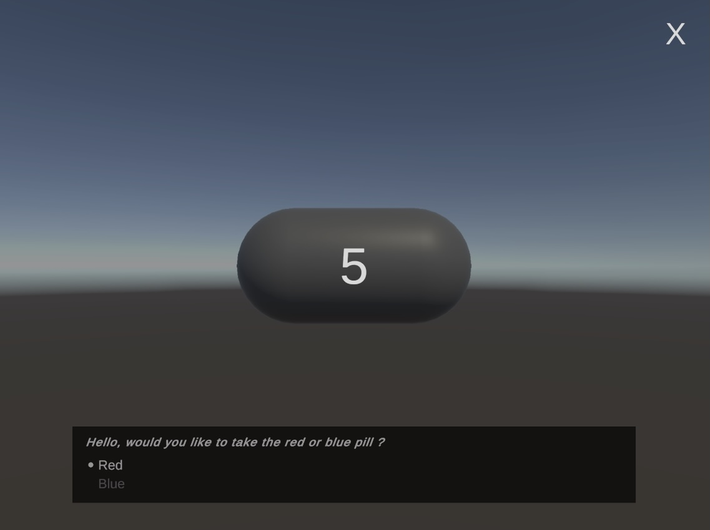

# Unity-Inactivity-Reset

A simple inactivity reset system for Unity.

[https://github.com/prossel/Unity-Inactivity-Reset](https://github.com/prossel/Unity-Inactivity-Reset)

## Installation

### With package manager

* Unity, menu Window > Package Manager
* Click the [ + ] button at top left
* Add Package from git URL...
* Enter this URL: `https://github.com/prossel/Unity-Inactivity-Reset.git`
* When you want to update the package, just use the [ Update ] button from the package in the package manager.

## Setup

1. Add the package to your project.
2. In an install scene, add the `InactivityResetManager` component to a GameObject and keep it alive across scene loads.
3. Set the `Reset Scene Override` field if you want to reset to a specific scene instead of the install scene.
4. If you want the package to use iOS system settings on Apple builds, run `Tools > Inactivity Reset > Create iOS Settings Bundle` in the Unity Editor. This creates `Assets/Plugins/iOS/Settings.bundle` with the default timeout of `60` seconds and countdown of `5` seconds. After installing the app, open the iOS Settings app and select the app to find and change these values.

The built-in post-build step will register the bundle with the generated Xcode project when building for iOS.

## Runtime behavior

* Idle timeout defaults to 60 seconds and countdown to 5 seconds.
* Any input while monitoring resets the idle timer.
* A four-corner touch gesture immediately starts the countdown without waiting for the idle timeout.
* While counting down, the overlay dims the screen and lets the user tap the countdown or the cancel icon to either reset immediately or cancel the reset.
* If the overlay is canceled, the package returns to monitoring and treats that interaction as activity.

## Notes

This package is designed to survive scene loads via `DontDestroyOnLoad`, so it can live in any install scene and keep monitoring across the rest of the experience.

## History

See [CHANGELOG.md](CHANGELOG.md)
